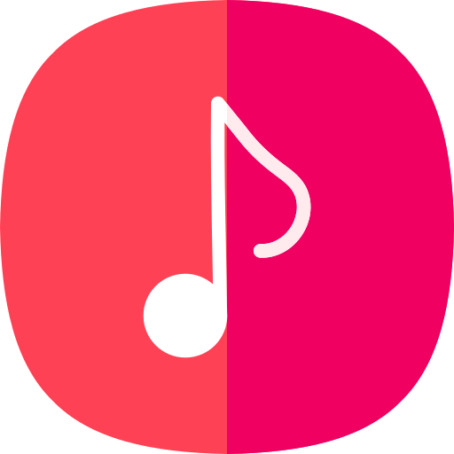
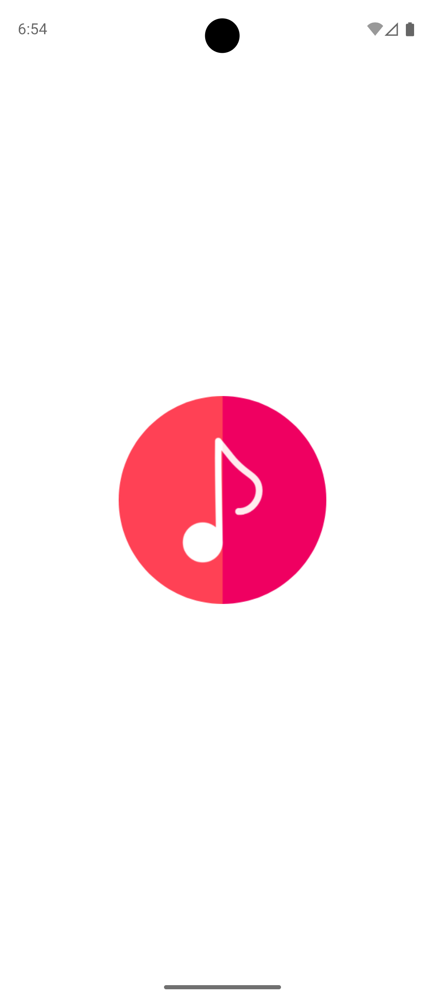
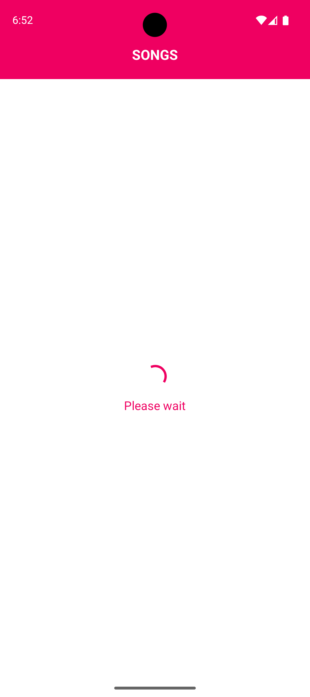
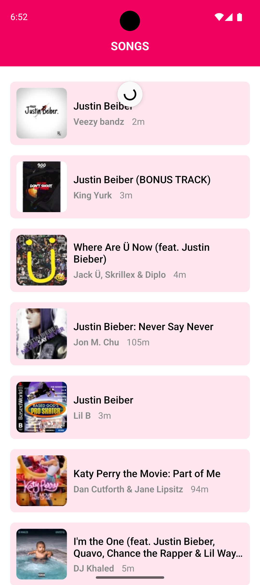
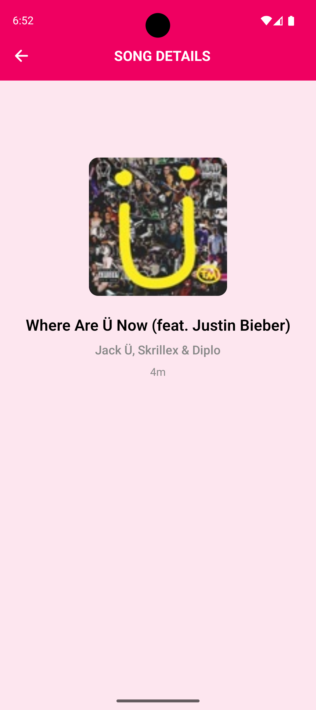

#  REDVisionSongs

A React Native app built using **Expo Router** that fetches and displays a list of songs using the iTunes Search API.


## Screens

    

### Splash Screen
Custom splash shown for 2–3 seconds before main content loads.

### Loading Screen
Displays a centered loading indicator while fetching data.

### Songs List
- Displays fetched songs in a styled FlatList (with image, title, artist, duration).
- Includes pull-to-refresh support.

### Song Detail
- Opens on tapping a song.
- Shows song artwork, title, artist, and duration.


## Run Locally

```bash
npm install
npx expo start
